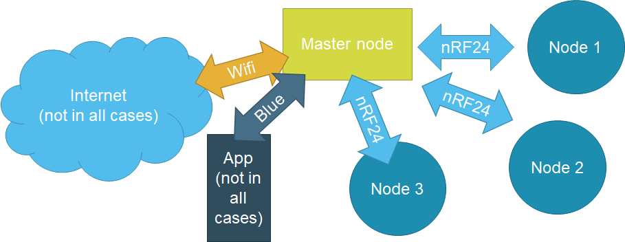
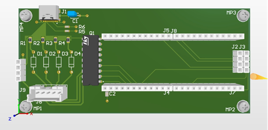
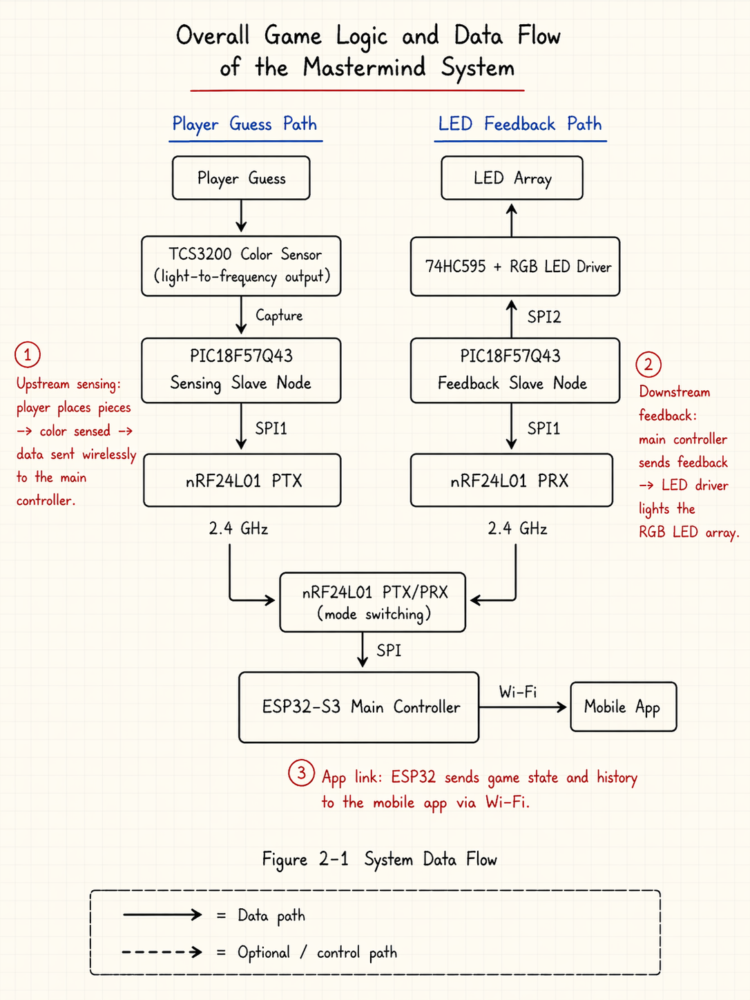
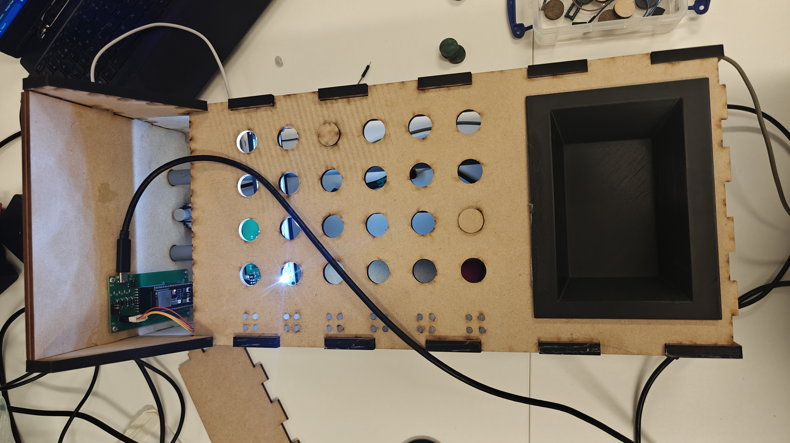

# Electronic Mastermind Board Game — ESP32 Controller Node

An ESP32 and PIC18-based electronic version of the classic **Mastermind** board game. Coloured
tokens placed on a physical board are read automatically by colour sensors, scored by the
controller, and the result is shown both on an on-board LED matrix and in a companion Android app.

This repository holds the **controller-node firmware** (the master), which runs the game logic,
coordinates the wireless nodes, drives the scanning platform, and serves the Android app.

> Engineering Experience 3 — Electronics and ICT Engineering, KU Leuven, Faculty of Engineering
> Technology, Group T Leuven Campus (2025–2026).
> Team: Zhengyu Zhang, Wenqi Miao, Aaron Dumlao, Victor Charlier, Kian Cardoen · Coach: Wout Tessens.

---

## Project Background

Traditional board games are simple and social, but players increasingly drift toward electronic
games that offer more functionality. *Mastermind* is a classic code-breaking game: one player hides
a secret colour code, the other tries to guess it, and after each guess receives feedback on how
many tokens are the right colour in the right place, and how many are the right colour in the wrong
place.

This project modernises Mastermind with embedded systems **without** turning it into a fully digital
game — the physical board, tokens, and tactile play are preserved, while sensing, scoring, feedback,
and a phone app are added on top. The work is framed as a reliability study: *what factors affect the
reliability of transforming a classic board game into a sensor-based embedded system?*

## Project Goal

- Detect the colour of physical tokens automatically with colour sensors (no manual scoring).
- Score each guess and display feedback through both an LED matrix and an Android companion app.
- Keep all subsystems communicating reliably over a low-latency wireless link.
- Move a sensor platform across the board automatically and return it to a repeatable start position.
- Meet concrete reliability targets: >90 % colour accuracy, <1 % packet loss, <12 s per turn,
  stable 3.3 V logic / 5 V motor supply.

## System Architecture

The system is split into **one controller node** (this firmware) and **two peripheral nodes** — a
sensing node and a feedback node — to distribute work and keep time-critical tasks local.



- **Controller node (ESP32-S3-WROOM-1)** — master. Owns all game rules, drives the stepper motor,
  and bridges the internal radio network to the Android app over Wi-Fi.
- **Sensing node (PIC18F57Q43)** — reads the four TCS3200 colour sensors and sends a normalised
  16-byte RGBC frame upstream.
- **Feedback node (PIC18F57Q43)** — drives the 24 Red/Green LEDs through CD4094 shift registers.
- **Wireless link** — nRF24L01 transceivers at 2.4 GHz carry short structured packets between nodes,
  leaving the ESP32 Wi-Fi free for the companion app.

## Hardware Components

| Component | Role |
|-----------|------|
| ESP32-S3-WROOM-1 | Controller / master MCU (dual-core, Wi-Fi) — **this node** |
| nRF24L01 (2.4 GHz) | Wireless link to sensing & feedback nodes |
| 28BYJ-48 5 V stepper + ULN2003A driver | Moving sensor platform (single axis, GT2 timing belt) |
| PIC18F57Q43 ×2 | Sensing-node and feedback-node MCUs |
| TCS3200 ×4 + 74HCT4051 multiplexer | Frequency-based colour sensing |
| CD4094 SIPO + MIC2981 gate driver + HLMP-4000 RG LEDs | Feedback display |
| Custom 3-PCB design, USB-C powered | Compact, low-noise wiring per node |

Controller-node PCB (ESP32-S3 + USB-C + ULN2003A motor-driver subcircuit with flyback diodes):



## Software Implementation

The controller firmware is built on **ESP-IDF** and **FreeRTOS**. The full data path — from a token
being placed to LED feedback and the app update — is shown below.



**Concurrency.** Two FreeRTOS tasks share the radio and network stack:

- `nrf_receive_task` — continuously reads 16-byte sensor frames from the nRF24L01.
- `tcp_server_task` — accepts one Android client on TCP port `5000` and handles its commands.

Two mutexes keep shared resources safe: `g_data_mutex` guards the sensor buffer, and `g_nrf_mutex`
serialises every access to the nRF24L01 so sensing-RX and feedback-TX never collide.

**Per-turn flow (in `main/main.c`):**

1. Receive a 16-byte RGBC frame and **classify** each token via RGB thresholds
   (`check_colour_from_rgb`).
2. Stream the current guess to the app once per second:
   `{"type":"GUESS","colors":[1,1,2,2]}`.
3. On `SUBMIT_GUESS`, **score** the guess against the secret code (`evaluate_guess` → exact matches
   and colour-only matches).
4. **Replay LED feedback** for every played row to the feedback node, then call
   `nrf_restore_sensor_rx_mode()` to switch the single radio back to receive.
5. **Advance the stepper** to the next row (`motor_run_1` … `motor_run_6`), or on win/loss return to
   row 1 and start a new game.

**App ↔ firmware protocol** — newline-delimited JSON over TCP:

| Direction | Message |
|-----------|---------|
| Firmware → app | `{"type":"GUESS","colors":[...]}` · `{"type":"FEEDBACK","exact":2,"color":1,"attemptsLeft":4,"gameState":"PLAYING"}` |
| App → firmware | `SUBMIT_GUESS` · `RESET` |

Colour ids: `1=RED 2=GREEN 3=BLUE 4=YELLOW 5=CYAN 6=MAGENTA`, `0=UNDEFINED`.

### Repository layout

| File | Responsibility |
|------|----------------|
| `main/main.c` | Entry point, Wi-Fi/TCP server, game loop, scoring, task orchestration |
| `main/NRF24L01.c/.h` · `NRF24L01_Define.h` | nRF24L01 driver and register definitions |
| `main/motor.c/.h` | 28BYJ-48 stepper control, per-row movement |
| `main/feedback_sender.c/.h` | Sends LED feedback packets to the feedback node |
| `main/led_patterns.c/.h` | LED position / colour definitions |
| `CMakeLists.txt`, `main/CMakeLists.txt` | ESP-IDF build files |

### Build & flash

```bash
idf.py set-target esp32s3
idf.py build
idf.py -p <PORT> flash monitor      # e.g. -p COM5 on Windows
```

On boot the firmware logs the IP it obtained; enter that IP with port `5000` in the Android app to
connect. Wi-Fi credentials and game settings are defines at the top of `main/main.c`
(`WIFI_SSID`, `WIFI_PASS`, `TCP_PORT`, `MAX_ROWS`, `SENSOR_RF_CHANNEL`).
*Replace the credentials with your own — don't commit real passwords.*

## Demo / Results

Assembled prototype (laser-cut MDF board, sensor platform on the left with the controller PCB, token
tray on the right):



Measured reliability (from the project paper):

| Metric | Target | Result |
|--------|--------|--------|
| Colour-detection accuracy | > 90 % | **93.3 %** (56/60); green & pink weakest at 80 % |
| Wireless feedback reliability | packet loss < 1 % | **100 %** over 17 input vectors |
| Average total response time | < 12 s | **6.77 s** (sensing dominates and varies most) |
| Restart (homing) success rate | every time | **62.5 %** (mechanical pulley/motor slip) |
| Supply voltage | 3.3 V logic / 5 V motor | within range except sensing node at 4.30 V |

**Takeaway:** system-level reliability is driven by subsystem interaction, not a single part —
sensing accuracy, mechanical repeatability, communication stability, and power behaviour all matter.

## My Contribution

> *(Wenqi Miao)* — adjust to match exactly what you did.

I worked on the **ESP32-S3 controller-node firmware in this repository**, including:

- The Wi-Fi station + TCP server and the JSON-line protocol used by the Android app
  (`GUESS` / `FEEDBACK` / `SUBMIT_GUESS` / `RESET`).
- The Mastermind game loop and scoring (`evaluate_guess`, exact vs colour-only matches) and the
  per-turn state machine for advancing rows, winning, losing, and restarting.
- Integrating the nRF24L01 receive path with the sensing node, and the radio mode-switching logic
  (`nrf_restore_sensor_rx_mode`) that lets a single transceiver handle both sensor RX and feedback
  TX without collisions.
- Stepper-platform control for moving between rows and returning to the start
  (`move_to_next_row`, `return_to_first_row`).
- FreeRTOS task and mutex design to keep sensor reception, the app connection, and the radio safe to
  share.

## License

Academic project — © KU Leuven, Group T Leuven Campus. Reuse of the methods, schematics, and
programs requires written permission of the course coordinator and the authors.
